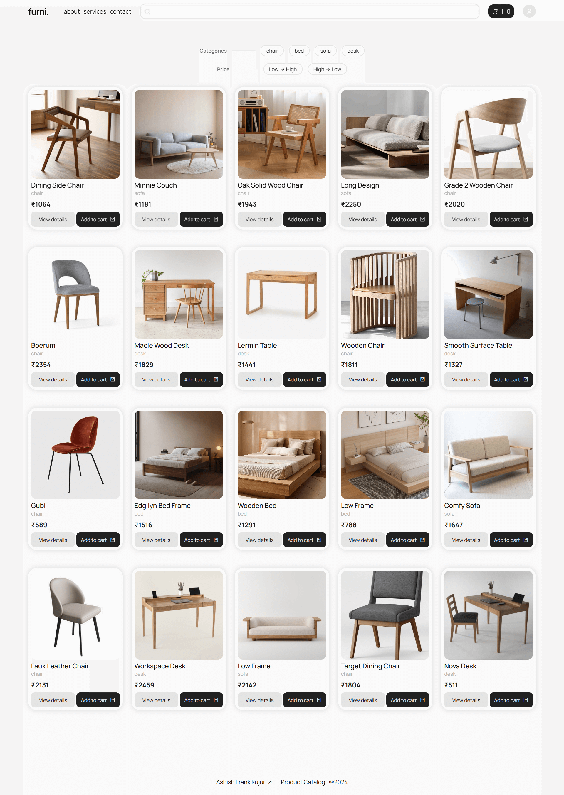
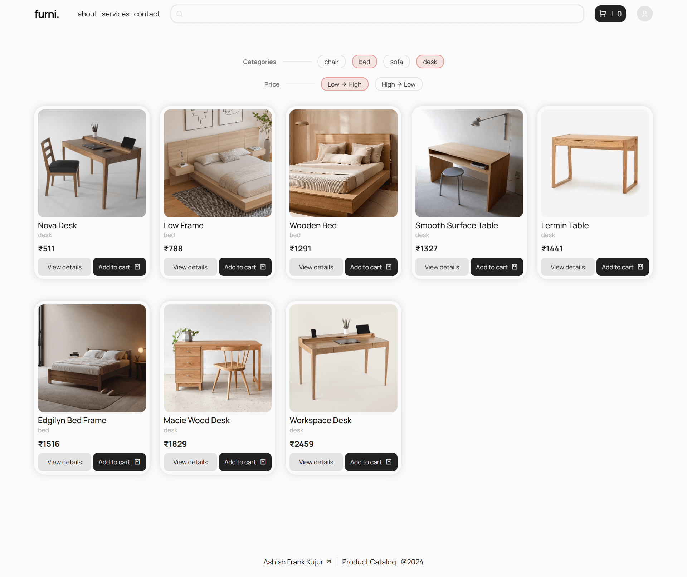
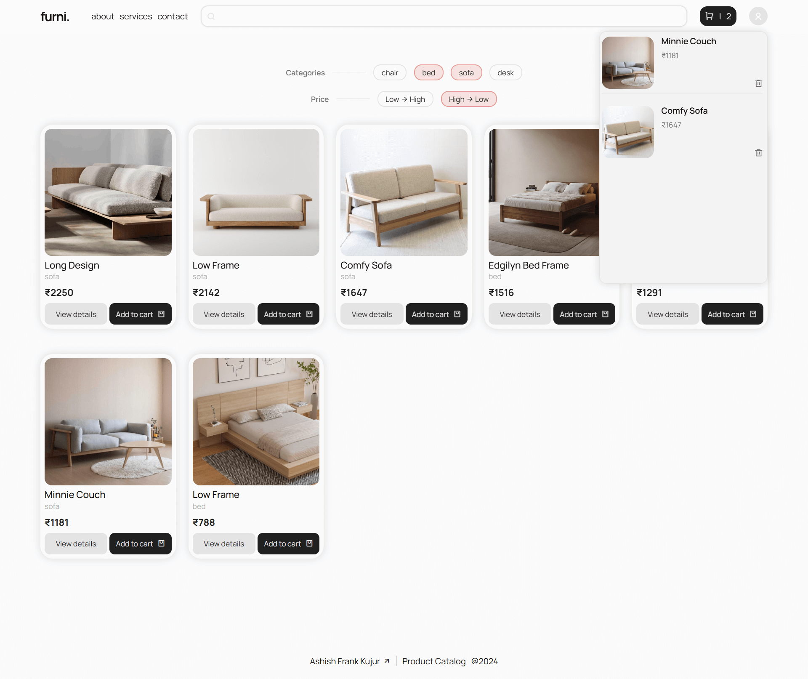
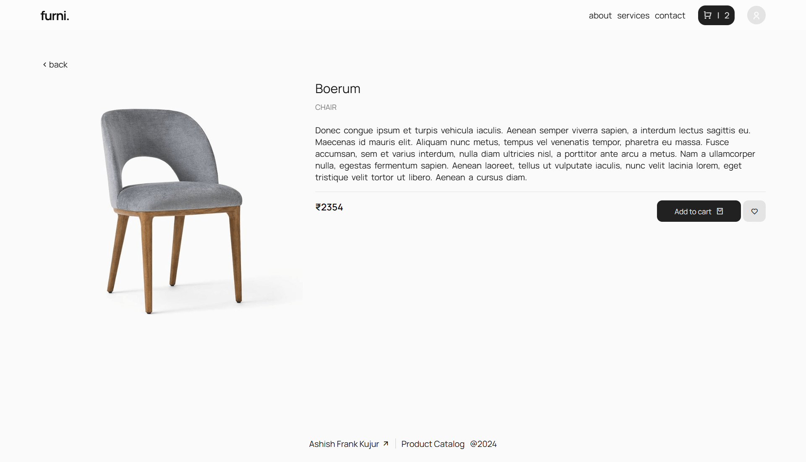
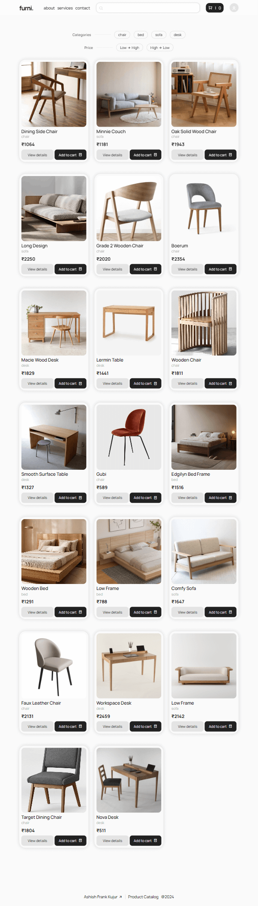
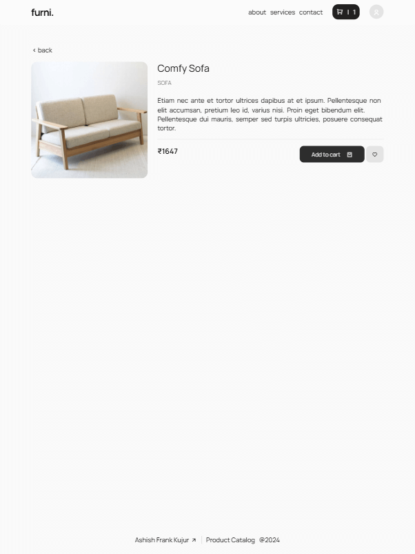
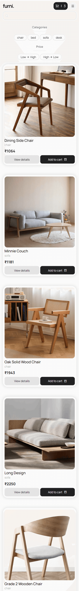
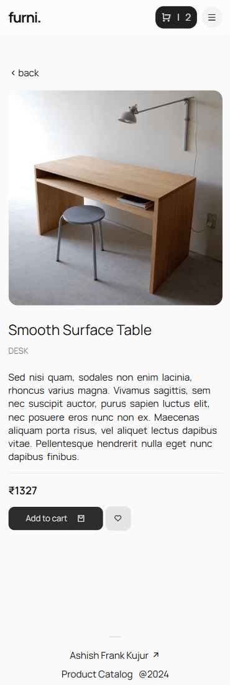

# 🛒 React Product Catalog

Web Application that displays a list of products
in a catalog format.

[🔗 Link to Live Project](https://react-product-catalog-project.vercel.app)

<br><br>


## 🚀 Install and run your application locally

#### 1. Get the repository URL
- Go to the React app's GitHub repository
- Click on the "Code" button and copy the HTTPS link

#### 2. Open Terminal and Clone
- Open your terminal and navigate to the desired directory where you want to clone the project
- Run the command:
```bash
  git clone [repository URL]
```

#### 3. Install Dependencies
- Navigate into the cloned directory:
```bash
  cd [project-name]
```
- Run this command to install necessary packages:
```bash
  npm install
```

#### 4. Start the App
- To launch the React application in your browser:
```bash
  npm run dev
```
<br><br>


## ⚙️ Additional libraries or tools used

#### 1. React Hot Toast
A lightweight yet powerful library for creating informative notifications

#### 2. React Hot Toast
A Routing Library to implement dynamic routing
<br><br>


## 🚧 Challenges faced

#### 1. Code Organization

Code organization can always be challanging yet a fun and constructive one. As a component grows in size in terms of its lines of code, to keep the code cleaner and organized, I isolated specific parts of the code to separate components.

I also created a custom hook for separating concerns, addressing the fetch logic in an isolated reusable function. 

#### 2. Syncing Search, Sort & Filter Functionality 

After sorting and filtering products, I noticed that performing a search would only search among the sorted and filtered products. In order to apply the search functionality on all the products, I made the searchbar reset the sort and filter features every time anything is typed on it, thereby allowing the app to search among all products.

#### 3. Addressing warnings

While integrating react router into the project, some warnings started showing up titled "React Router Future Flag". I looked it up on the React Router DOM documentation, which suggested to enable certain flags to avoid the error, and it worked.
<br><br>


## ⚡ Optional Enhancements

#### I implemented all Optional Enhancements as mentioned in the Assignment PDF provided:


✨ Sorting

✨ Sort products by price (ascending or descending)

✨ Add to Cart Functionality

✨ Enable users to add products to a cart

✨ Display cart and the number of items in the cart

✨ Animations (hover effects or transitions)

✨ Custom Styles

#### Additional Enhancements:

🌟 Toast feature (display notifications)
<br><br>


## 📸 Screenshots

Home



Sort & Filter



Cart Items



Product Details



Tablet Home



Tablet Details



Mobile Home



Mobile Details


